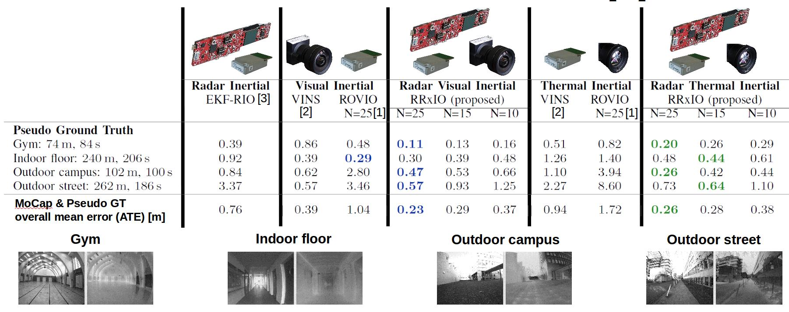

# TODO: Custom dataset
1. rrxio/rrxio/launch/custom.launch : topic names √, config file names √，timeshift_cam_imu √, start, duration.
2. rrxio/rrxio/launch/configs/custom_visual.info : qCM √, MrMc √
3. custom_visual.yaml: camera intrinsics√
4. custom_radar_calib.yaml: radar √

# RRxIO - Robust Radar Visual/Thermal Inertial Odometry

RRxIO offers robust and accurate state estimation even in challenging visual conditions. RRxIO combines radar ego velocity estimates and Visual Inertial Odometry (VIO) or Thermal
Inertial Odometry (TIO) in a single filter by extending [rovio](https://github.com/ethz-asl/rovio). Thus, state estimation in challenging visual conditions (e.g. darkness, direct sunlight, fog) or challenging thermal
conditions (e.g. temperature gradient poor environments or outages caused by non uniformity corrections) is possible. In addition, the drift free radar ego velocity estimates reduce scale errors and the
overall accuracy as compared to monocular VIO/TIO. RRxIO runs many times faster than real-time on an Intel NUC i7 and achieves real-time on an UpCore embedded computer.

## Cite

If you use RRxIO for your academic research, please cite our related [paper](https://christopherdoer.github.io/publication/2021_09_IROS2021):

~~~[bibtex]
@INPROCEEDINGS{DoerIros2021,
  author={Doer, Christopher and Trommer, Gert F.},
  booktitle={2021 IEEE/RSJ International Conference on Intelligent Rotots and Sytems (IROS)}, 
  title={Radar Visual Inertial Odometry and Radar Thermal Inertial Odometry: Robust Navigation even in Challenging Visual Conditions}, 
  year={2021}}
~~~

## Demo Result: [IRS Radar Thermal Visual Inertial Datasets IROS 2021](https://christopherdoer.github.io/datasets/irs_rtvi_datasets_iros2021)

### Motion Capture Lab (translational RMSE (ATE [m]))

### Indoor and Outdoors (translational RMSE (ATE [m]))

### Runtime (Real-time factor)

## Getting Started

RRxIO depends on:

- Ubuntu 16.04 and ROS Kinetic
- [catkin_simple](https://github.com/catkin/catkin_simple.git)
- [catkin_tools](https://catkin-tools.readthedocs.io/en/latest/)
- [yaml_cpp_catkin](https://github.com/ethz-asl/yaml_cpp_catkin.git)

Additional dependencies are required to run the evaluation framework:

- sudo apt-get install texlive-latex-extra texlive-fonts-recommended dvipng cm-super
- pip2 install -U PyYAML colorama ruamel.yaml==0.15.0

The following dependencies are included via git submodules (run once upon setup: `git submodule update --init --recursive`):
- [rovio](https://github.com/ethz-asl/rovio)
- [kindr](https://github.com/ethz-asl/kindr)
- [reve](https://github.com/christopherdoer/reve)
- [rpg_trajectory_evaluation (own fork)](https://github.com/christopherdoer/rpg_trajectory_evaluation)

**Build in Release is highly recommended**:

~~~[shell]
catkin build rrxio -j2 --cmake-args -DCMAKE_BUILD_TYPE=Release
~~~

Depending on the RAM available -j2 or -j1 avoids issues.
Per default, only the rosbag_nodes are built. 
To use the online mode, the [rrxio/CMakeLists.txt](https://github.com/christopherdoer/rrxio/blob/master/rrxio/CMakeLists.txt) needs to be changed.

## Run Demos

Download the [IRS Radar Thermal Visual Inertial Datasets IROS 2021](https://christopherdoer.github.io/datasets/irs_rtvi_datasets_iros2021) datasets.

Run the mocap_easy datasets with visual RRxIO:

~~~[shell]
roslaunch rrxio rrxio_visual_iros_demo.launch rosbag_dir:=<path-to-rtvi_datastets_iros_2021> rosbag:=mocap_easy
~~~

Run the outdoor_street datasets with thermal RRxIO:

~~~[shell]
roslaunch rrxio rrxio_thermal_iros_demo.launch rosbag_dir:=<path-to-rtvi_datastets_iros_2021> rosbag:=outdoor_street
~~~

## Run Evaluation IRS Radar Thermal Visual Inertial Datasets IROS 2021

The evaluation script is also provided which does an extensive evaluation of RRxIO_10, RRxIO_15, RRxIO_25 on all [IRS Radar Thermal Visual Inertial Datasets IROS 2021](https://christopherdoer.github.io/datasets/irs_rtvi_datasets_iros2021)
datasets:

~~~[shell]
rosrun rrxio evaluate_iros_datasets.py <path-to-rtvi_datastets_iros_2021>
~~~

After some time, the results can be found at <path-to-rtvi_datastets_iros_2021>/results/evaluation/<10/15/25>/evaluation_full_align.
These results are also shown in the table above.

